<div align="center">


# POS +  (React Point of Sale)

**A modern Point of Sale (POS) application built with React, TypeScript and Tailwind CSS**

[](https://reactjs.org/)
[](https://www.typescriptlang.org/)
[](https://tailwindcss.com/)
[](https://vitejs.dev/)

[🚀 Live Demo](https://posplus.netlify.app/) | [📖 Documentation](#key-features) | [🛠️ Installation](#installation-and-setup)

</div>

---
<p align="center">
  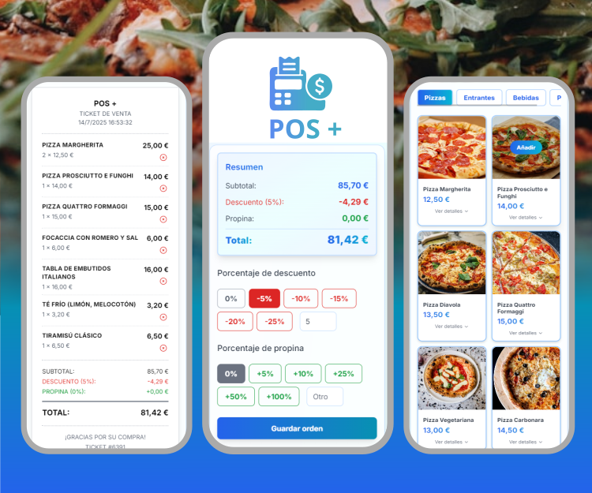
  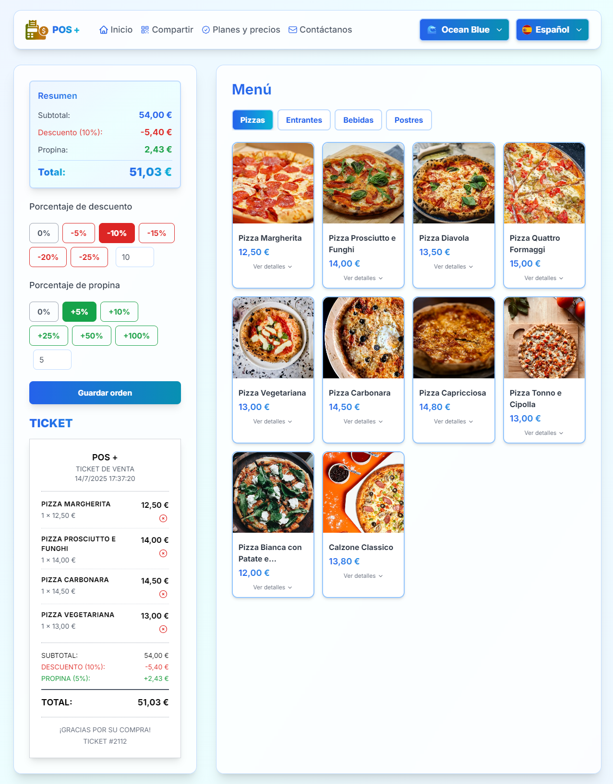
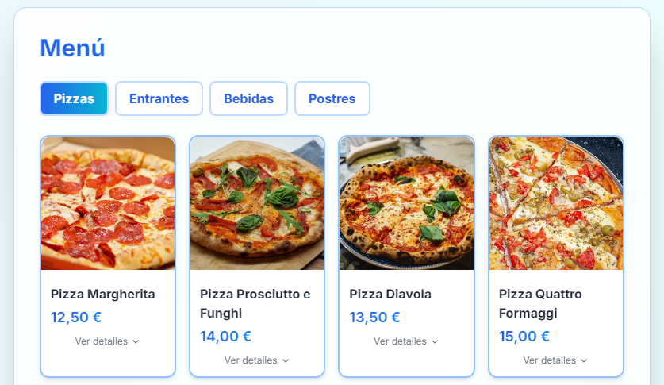
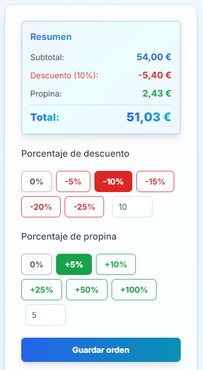
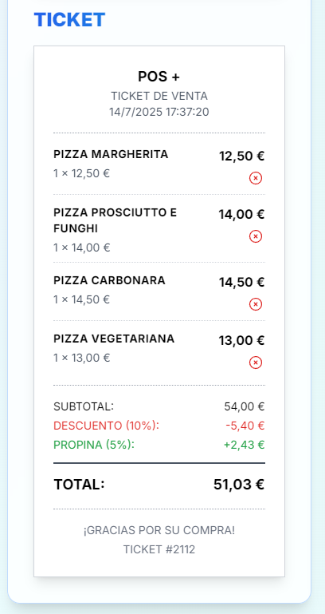
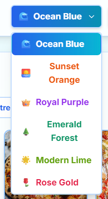
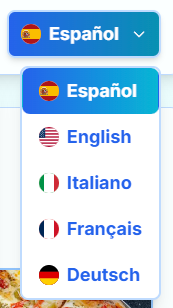</p>

## Custom templates
<p>
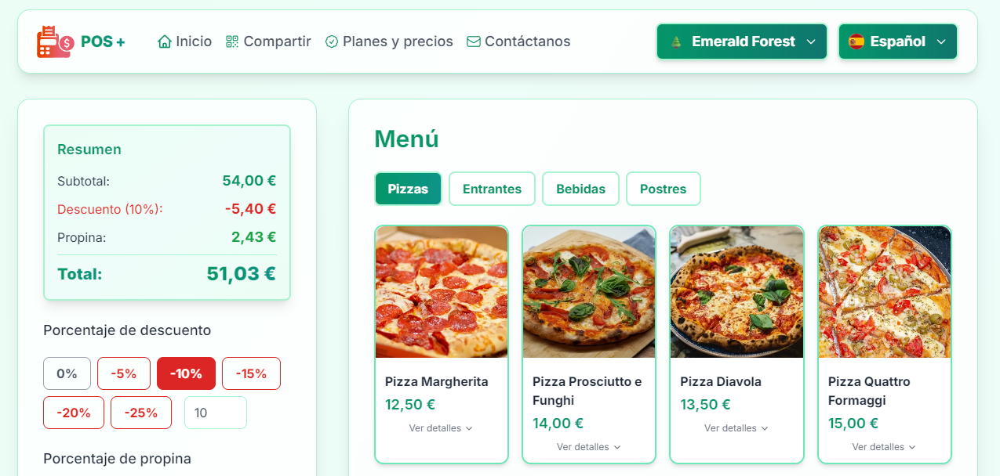
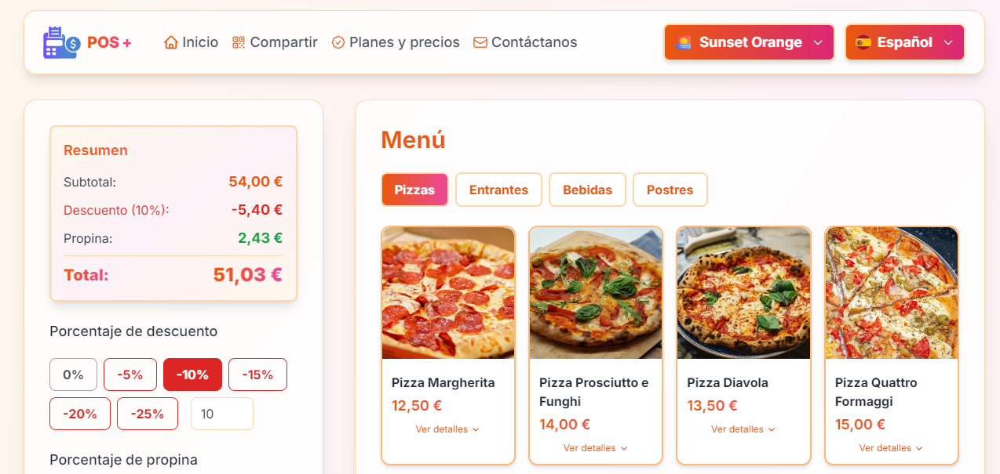
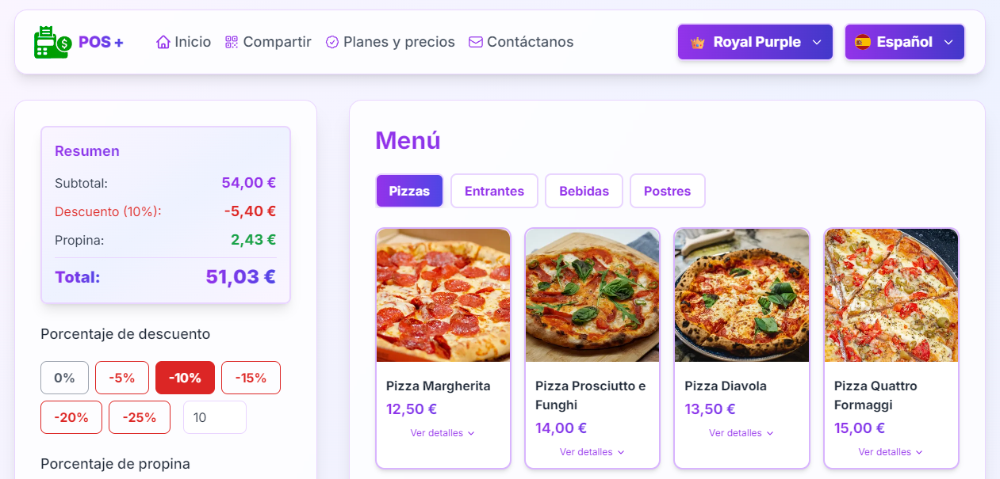
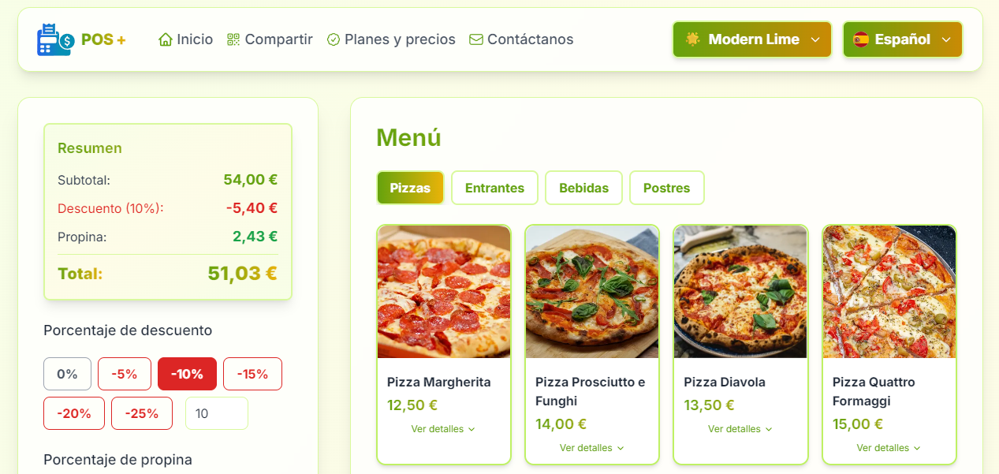
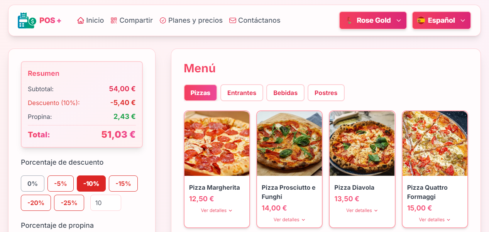
</p>
---

## ✨ Key Features

### 🎨 **Dynamic Template System**
- **6 Customizable Themes**: Modern Lime, Ocean Blue, Sunset Orange, Royal Purple, Emerald Forest, Rose Gold
- **Real-time color changes** across the entire interface
- **Adaptive logo** with dynamic CSS filters

### 🌍 **Multi-language Support (i18n)**
- **5 Available Languages**: Spanish, English, Italian, French, German
- **Intuitive selector** with country flags
- **Complete translations** including POS-specific terminology

### 🧮 **Advanced Calculation System**
- **Configurable Tips**: 0%, 5%, 10%, 25%, 50%, 100%
- **Customizable Discounts**: 0%, 5%, 10%, 15%, 20%, 25%
- **Automatic calculations** for subtotals, discounts and totals
- **Thermal printer ticket** with authentic formatting

### 📱 **Responsive Design**
- **Adaptive interface** for desktop, tablet and mobile
- **Dynamic grid** that adjusts to screen size
- **Optimized user experience** on all devices

---

## 🛠️ Tech Stack

### **Frontend Core**
```typescript
// Main technologies used
const techStack = {
  framework: "React 18.3.1",
  language: "TypeScript 5.5.3",
  styling: "Tailwind CSS 3.4.17",
  bundler: "Vite 5.0+",
  routing: "React Router DOM 7.6.3"
}
```

### **State Management**
```typescript
// Implementation with useReducer to handle order state
const [state, dispatch] = useReducer(orderReducer, initialState)

// Reducer actions
type OrderActions = 
  | { type: 'add-item'; payload: { item: MenuItem } }
  | { type: 'remove-item'; payload: { id: number } }
  | { type: 'clear-order' }
  | { type: 'update-tip'; payload: { tip: number } }
  | { type: 'update-discount'; payload: { discount: number } }
```

### **Template System**
```typescript
// Dynamic theme configuration
const TEMPLATES = [
  { 
    id: 'modern', 
    name: 'Modern Lime',
    icon: '🌟',
    colors: {
      primary: 'from-lime-600 to-yellow-500',
      primaryHover: 'from-lime-700 to-yellow-600',
      bg: 'from-lime-50 via-yellow-50 to-lime-50',
      border: 'border-lime-200',
      text: 'text-lime-600'
    }
  }
  // ... more templates
] as const
```

---

## 🚀 Installation and Setup

### **Prerequisites**
- Node.js >= 18.0.0
- npm >= 8.0.0

### **Installation**
```bash
# Clone the repository
git clone https://github.com/firedevelop/POSplus.git

# Navigate to directory
cd POSplus

# Install dependencies
npm install

# Start development server
npm run dev
```

### **Available Scripts**
```json
{
  "scripts": {
    "dev": "vite",              // Development server
    "build": "tsc -b && vite build",  // Production build
    "lint": "eslint .",         // Code linting
    "preview": "vite preview"   // Build preview
  }
}
```

---

## 🏗️ Project Architecture

```
src/
├── components/           # Reusable components
│   ├── Header.tsx       # Main navigation
│   ├── MenuItem.tsx     # Product card
│   ├── OrderContents.tsx # Order content
│   └── ...
├── data/                # Menu data
│   └── menu/
│       ├── es-ES.ts     # Spanish menu
│       ├── en-US.ts     # English menu
│       └── ...
├── i18n/                # Internationalization
│   ├── es-ES.ts         # Spanish translations
│   ├── en-US.ts         # English translations
│   └── ...
├── pages/               # Application pages
├── reducers/            # State management
├── types/               # TypeScript definitions
└── App.tsx              # Main component
```

---

## 💡 Outstanding Technical Features

### **🎯 Scalable State Management**
```typescript
// Reducer pattern for complex state handling
const orderReducer = (state: OrderState, action: OrderActions): OrderState => {
  switch (action.type) {
    case 'add-item':
      const existingItem = state.order.find(item => item.id === action.payload.item.id)
      if (existingItem) {
        return {
          ...state,
          order: state.order.map(item =>
            item.id === action.payload.item.id
              ? { ...item, quantity: item.quantity + 1 }
              : item
          )
        }
      }
      return {
        ...state,
        order: [...state.order, { ...action.payload.item, quantity: 1 }]
      }
    // ... more cases
  }
}
```

### **🎨 Dynamic Theming**
```typescript
// Template system with TypeScript
type Template = {
  id: string
  name: string
  icon: string
  colors: {
    primary: string
    primaryHover: string
    bg: string
    border: string
    text: string
  }
}

// Dynamic style application
const dynamicStyles = `bg-gradient-to-r ${template?.colors?.primary}`
```

### **🌍 Robust Internationalization**
```typescript
// Typed translation structure
interface Translations {
  menu: string
  home: string
  contact: string
  ticket: {
    title: string
    header: string
    subtotal: string
    total: string
  }
}
```

---

## 📊 POS Functionality

### **🛒 Order Management**
- ✅ Add/remove products with one click
- ✅ Automatic quantities when adding duplicate products
- ✅ Real-time subtotal calculations
- ✅ Percentage discount system
- ✅ Configurable tips

### **🧾 Ticket Generation**
- ✅ Authentic thermal printer format
- ✅ Automatic ticket numbering
- ✅ Detailed product information
- ✅ Tax and total calculations
- ✅ Print-optimized design

### **🎨 Customization**
- ✅ 6 predefined color themes
- ✅ Default template configuration
- ✅ Automatic UI adaptation
- ✅ Dynamic logo color changes

---

## 🎯 Use Cases

### **🍕 Restaurants**
Perfect for pizzerias, cafes and restaurants that need a modern and easy-to-use POS system.

### **🛍️ Retail**
Adaptable for small and medium stores that require discount and tip calculations.

### **📱 Kiosks**
Intuitive interface ideal for self-service systems and interactive kiosks.

---

## 🔧 Advanced Configuration

### **Change Default Template**
```typescript
// In src/App.tsx
const DEFAULT_TEMPLATE: TemplateId = 'ocean' // Change here
```

### **Add New Languages**
```typescript
// 1. Create file in src/i18n/
// 2. Add to LANGS array in App.tsx
const LANGS = [
  { code: 'pt-BR', flag: 'https://flagcdn.com/br.svg', label: 'Português' }
]
```

### **Customize Products**
```typescript
// In src/data/menu/
export const menu = {
  pizzas: [
    {
      id: 1,
      name: "Margherita",
      price: 12.99,
      image: "/images/pizza-001.webp",
      description: "Tomato, mozzarella and fresh basil"
    }
  ]
}
```

---

## 📈 Performance and Optimization

- ⚡ **Optimized build** with Vite for fast loading
- 🔄 **Lazy loading** of components and routes
- 📱 **Responsive design** with optimized breakpoints
- 🎨 **Optimized CSS** with Tailwind CSS purging
- 🧹 **Clean code** with ESLint and TypeScript

---

## 🤝 Contributing

Contributions are welcome! If you want to improve this project:

1. Fork the project
2. Create a feature branch (`git checkout -b feature/new-feature`)
3. Commit your changes (`git commit -am 'Add new feature'`)
4. Push to the branch (`git push origin feature/new-feature`)
5. Open a Pull Request

---

## 👨‍💻 Developed by

**fireDevelop**
- 🌐 [Website](https://firedevelop.com)

---

<div align="center">

**⭐ If you like this project, give it a star on GitHub! ⭐**

</div>

---
## 📄 License

This project is under the MIT License. See the [LICENSE](LICENSE) file for more details.

### Mockup
Photo by <a href="https://unsplash.com/@tuqa?utm_content=creditCopyText&utm_medium=referral&utm_source=unsplash">Tuqa Nabi</a> on <a href="https://unsplash.com/photos/a-person-pouring-olive-oil-on-a-pizza-AgiUMlpPz6M?utm_content=creditCopyText&utm_medium=referral&utm_source=unsplash">Unsplash</a>      

### Pizzas

Photo by <a href="https://unsplash.com/@aurel__lens?utm_content=creditCopyText&utm_medium=referral&utm_source=unsplash">Aurélien Lemasson-Théobald</a> on <a href="https://unsplash.com/photos/round-cooked-pizza-x00CzBt4Dfk?utm_content=creditCopyText&utm_medium=referral&utm_source=unsplash">Unsplash</a>

Photo by <a href="https://unsplash.com/@amir_v_ali?utm_content=creditCopyText&utm_medium=referral&utm_source=unsplash">amirali mirhashemian</a> on <a href="https://unsplash.com/photos/pizza-with-green-leaves-and-red-sauce-XtLPfib7OuM?utm_content=creditCopyText&utm_medium=referral&utm_source=unsplash">Unsplash</a>
      
Photo by <a href="https://unsplash.com/@louishansel?utm_content=creditCopyText&utm_medium=referral&utm_source=unsplash">Louis Hansel</a> on <a href="https://unsplash.com/photos/cooked-food-on-round-white-ceramic-plate-cC0_UO1Obg4?utm_content=creditCopyText&utm_medium=referral&utm_source=unsplash">Unsplash</a>
      
Photo by <a href="https://unsplash.com/@louishansel?utm_content=creditCopyText&utm_medium=referral&utm_source=unsplash">Louis Hansel</a> on <a href="https://unsplash.com/photos/cooked-food-on-round-white-ceramic-plate-cC0_UO1Obg4?utm_content=creditCopyText&utm_medium=referral&utm_source=unsplash">Unsplash</a>

Photo by <a href="https://unsplash.com/@alanaktion?utm_content=creditCopyText&utm_medium=referral&utm_source=unsplash">Alan Hardman</a> on <a href="https://unsplash.com/photos/pepperoni-pizza-SU1LFoeEUkk?utm_content=creditCopyText&utm_medium=referral&utm_source=unsplash">Unsplash</a>

Photo by <a href="https://unsplash.com/@saahilkhatkhate?utm_content=creditCopyText&utm_medium=referral&utm_source=unsplash">Saahil Khatkhate</a> on <a href="https://unsplash.com/photos/pizza-on-brown-wooden-table-kfDsMDyX1K0?utm_content=creditCopyText&utm_medium=referral&utm_source=unsplash">Unsplash</a>

Photo by <a href="https://unsplash.com/@saundiii?utm_content=creditCopyText&utm_medium=referral&utm_source=unsplash">Saundarya Srinivasan</a> on <a href="https://unsplash.com/photos/pizza-with-green-leaves-on-top-60nzTP7_hMQ?utm_content=creditCopyText&utm_medium=referral&utm_source=unsplash">Unsplash</a>

Photo by <a href="https://unsplash.com/@mafimo?utm_content=creditCopyText&utm_medium=referral&utm_source=unsplash">Masimo Grabar</a> on <a href="https://unsplash.com/photos/baked-pizza-NzHRSLhc6Cs?utm_content=creditCopyText&utm_medium=referral&utm_source=unsplash">Unsplash</a>
      
Photo by <a href="https://unsplash.com/@jkakaroto?utm_content=creditCopyText&utm_medium=referral&utm_source=unsplash">Jonas Kakaroto</a> on <a href="https://unsplash.com/photos/pepperoni-pizz-zlKdLdMREtE?utm_content=creditCopyText&utm_medium=referral&utm_source=unsplash">Unsplash</a>

Photo by <a href="https://unsplash.com/@shouravsheikh?utm_content=creditCopyText&utm_medium=referral&utm_source=unsplash">Shourav Sheikh</a> on <a href="https://unsplash.com/photos/pizza-with-pepperoni-and-cheese-on-orange-table-xLfqx4Psf94?utm_content=creditCopyText&utm_medium=referral&utm_source=unsplash">Unsplash</a>
      

      
### Starters
Photo by <a href="https://unsplash.com/@hybridstorytellers?utm_content=creditCopyText&utm_medium=referral&utm_source=unsplash">Hybrid Storytellers</a> on <a href="https://unsplash.com/photos/a-table-topped-with-plates-of-food-covered-in-sauce-X0R1I9uh33w?utm_content=creditCopyText&utm_medium=referral&utm_source=unsplash">Unsplash</a>
      
Photo by <a href="https://unsplash.com/@fotosdealimentos?utm_content=creditCopyText&utm_medium=referral&utm_source=unsplash">Fotografía de Alimentos</a> on <a href="https://unsplash.com/photos/a-wooden-table-topped-with-a-plate-of-food-and-chopsticks-WPHDpITnv9Q?utm_content=creditCopyText&utm_medium=referral&utm_source=unsplash">Unsplash</a>

Photo by <a href="https://unsplash.com/@omertahacetin?utm_content=creditCopyText&utm_medium=referral&utm_source=unsplash">Ömer Taha Çetin</a> on <a href="https://unsplash.com/photos/a-plate-of-food-on-a-wooden-table-3t6uv-c-xys?utm_content=creditCopyText&utm_medium=referral&utm_source=unsplash">Unsplash</a>

Photo by <a href="https://unsplash.com/@1clickaf?utm_content=creditCopyText&utm_medium=referral&utm_source=unsplash">1Click</a> on <a href="https://unsplash.com/photos/a-close-up-of-a-plate-of-food-on-a-table-wXYlh6KJqG0?utm_content=creditCopyText&utm_medium=referral&utm_source=unsplash">Unsplash</a>

Photo by <a href="https://unsplash.com/@fryfamilyfoodco?utm_content=creditCopyText&utm_medium=referral&utm_source=unsplash">The Fry Family Food Co.</a> on <a href="https://unsplash.com/photos/a-tray-of-food-with-chopsticks-and-dipping-sauce-enryqd8xpIQ?utm_content=creditCopyText&utm_medium=referral&utm_source=unsplash">Unsplash</a>

Photo by <a href="https://unsplash.com/@fayyazkh?utm_content=creditCopyText&utm_medium=referral&utm_source=unsplash">FAYYAZ KH</a> on <a href="https://unsplash.com/photos/vegetable-salad-with-sliced-fried-chicken-in-square-black-bowl-sr18nRcaGT0?utm_content=creditCopyText&utm_medium=referral&utm_source=unsplash">Unsplash</a>

Photo by <a href="https://unsplash.com/@karina_brovchenko?utm_content=creditCopyText&utm_medium=referral&utm_source=unsplash">Karina B.</a> on <a href="https://unsplash.com/photos/a-red-bowl-filled-with-meat-and-vegetables-T8EZ42yL8VM?utm_content=creditCopyText&utm_medium=referral&utm_source=unsplash">Unsplash</a>

Photo by <a href="https://unsplash.com/@anil_sharma_india?utm_content=creditCopyText&utm_medium=referral&utm_source=unsplash">Anil Sharma</a> on <a href="https://unsplash.com/photos/a-black-plate-topped-with-fried-food-on-top-of-a-counter-AAOZNDwsTuY?utm_content=creditCopyText&utm_medium=referral&utm_source=unsplash">Unsplash</a>

Photo by <a href="https://unsplash.com/@lingchor?utm_content=creditCopyText&utm_medium=referral&utm_source=unsplash">Lingchor</a> on <a href="https://unsplash.com/photos/brown-cookies-on-black-ceramic-plate-PG5W85aaC4k?utm_content=creditCopyText&utm_medium=referral&utm_source=unsplash">Unsplash</a>
                                                

### Drinks
Photo by <a href="https://unsplash.com/@whitney_wright?utm_content=creditCopyText&utm_medium=referral&utm_source=unsplash">Whitney Wright</a> on <a href="https://unsplash.com/photos/three-clear-drinking-glasses-filled-with-juice-TgQkxQc-t_U?utm_content=creditCopyText&utm_medium=referral&utm_source=unsplash">Unsplash</a>

Photo by <a href="https://unsplash.com/@lgnwvr?utm_content=creditCopyText&utm_medium=referral&utm_source=unsplash">LOGAN WEAVER | @LGNWVR</a> on <a href="https://unsplash.com/photos/clear-drinking-glass-with-ice-cubes-and-sliced-of-tomato-B9lUt97FL9I?utm_content=creditCopyText&utm_medium=referral&utm_source=unsplash">Unsplash</a>

Photo by <a href="https://unsplash.com/@edwardhowellphotography?utm_content=creditCopyText&utm_medium=referral&utm_source=unsplash">Edward Howell</a> on <a href="https://unsplash.com/photos/clear-wine-glass-with-orange-liquid-jNs7IPdt4HQ?utm_content=creditCopyText&utm_medium=referral&utm_source=unsplash">Unsplash</a>

Photo by <a href="https://unsplash.com/@kekse_und_ich?utm_content=creditCopyText&utm_medium=referral&utm_source=unsplash">Svitlana</a> on <a href="https://unsplash.com/photos/a-drink-with-a-garnish-garnish-garnish-garnish-w7dlfv2BWvs?utm_content=creditCopyText&utm_medium=referral&utm_source=unsplash">Unsplash</a>

Photo by <a href="https://unsplash.com/@heftiba?utm_content=creditCopyText&utm_medium=referral&utm_source=unsplash">Toa Heftiba</a> on <a href="https://unsplash.com/photos/fruit-juice-cups-beside-yellow-bananas-on-plate-yFLd5x6vfYM?utm_content=creditCopyText&utm_medium=referral&utm_source=unsplash">Unsplash</a>
      
Photo by <a href="https://unsplash.com/@iamhogir?utm_content=creditCopyText&utm_medium=referral&utm_source=unsplash">Hogir saeed</a> on <a href="https://unsplash.com/photos/a-smoothie-with-kiwi-slices-on-top-of-it-wN01KQVMAIQ?utm_content=creditCopyText&utm_medium=referral&utm_source=unsplash">Unsplash</a>

Photo by <a href="https://unsplash.com/@giorgiiremadze?utm_content=creditCopyText&utm_medium=referral&utm_source=unsplash">Giorgi Iremadze</a> on <a href="https://unsplash.com/photos/green-liquid-in-clear-drinking-glass-with-straw-3OV0ft7mG_o?utm_content=creditCopyText&utm_medium=referral&utm_source=unsplash">Unsplash</a>

Photo by <a href="https://unsplash.com/@dibaglin?utm_content=creditCopyText&utm_medium=referral&utm_source=unsplash">ShengGeng Lin</a> on <a href="https://unsplash.com/photos/macro-shot-photography-of-mug-MLxu9kE082c?utm_content=creditCopyText&utm_medium=referral&utm_source=unsplash">Unsplash</a>

Photo by <a href="https://unsplash.com/@dibaglin?utm_content=creditCopyText&utm_medium=referral&utm_source=unsplash">ShengGeng Lin</a> on <a href="https://unsplash.com/photos/sliced-watermelon-with-lemon-on-shot-glass-XoN3v3Ge7EE?utm_content=creditCopyText&utm_medium=referral&utm_source=unsplash">Unsplash</a>

Photo by <a href="https://unsplash.com/@edwardhowellphotography?utm_content=creditCopyText&utm_medium=referral&utm_source=unsplash">Edward Howell</a> on <a href="https://unsplash.com/photos/clear-drinking-glass-with-orange-juice-3wTB8cwSmzE?utm_content=creditCopyText&utm_medium=referral&utm_source=unsplash">Unsplash</a>


### Desserts
Photo by <a href="https://unsplash.com/@joyfulcaptures?utm_content=creditCopyText&utm_medium=referral&utm_source=unsplash">Joyful</a> on <a href="https://unsplash.com/photos/strawberry-and-banana-on-white-ceramic-plate-vT5xrj3z1OE?utm_content=creditCopyText&utm_medium=referral&utm_source=unsplash">Unsplash</a>

Photo by <a href="https://unsplash.com/@kobbymendez?utm_content=creditCopyText&utm_medium=referral&utm_source=unsplash">Kobby Mendez</a> on <a href="https://unsplash.com/photos/white-ice-cream-on-brown-cookie-idTwDKt2j2o?utm_content=creditCopyText&utm_medium=referral&utm_source=unsplash">Unsplash</a>

Photo by <a href="https://unsplash.com/@kaaficlever?utm_content=creditCopyText&utm_medium=referral&utm_source=unsplash">Shivansh Sethi</a> on <a href="https://unsplash.com/photos/chocolate-cake-with-white-icing-on-white-ceramic-plate-dKT6Q7q2UKs?utm_content=creditCopyText&utm_medium=referral&utm_source=unsplash">Unsplash</a>

Photo by <a href="https://unsplash.com/@emilembunzama?utm_content=creditCopyText&utm_medium=referral&utm_source=unsplash">Emile Mbunzama</a> on <a href="https://unsplash.com/photos/oreo-cookie-sandwiches-dessert-in-short-stem-glass-cLpdEA23Z44?utm_content=creditCopyText&utm_medium=referral&utm_source=unsplash">Unsplash</a>
      
Photo by <a href="https://unsplash.com/@maryamo?utm_content=creditCopyText&utm_medium=referral&utm_source=unsplash">Maryam Abubakar</a> on <a href="https://unsplash.com/photos/a-cookie-in-a-jar-with-sprinkles-and-sprinkles-IDq4UVk-q1k?utm_content=creditCopyText&utm_medium=referral&utm_source=unsplash">Unsplash</a>

Photo by <a href="https://unsplash.com/@heatherbarnes?utm_content=creditCopyText&utm_medium=referral&utm_source=unsplash">Heather Barnes</a> on <a href="https://unsplash.com/photos/macarons-on-table-WbZesfqwR-A?utm_content=creditCopyText&utm_medium=referral&utm_source=unsplash">Unsplash</a>

Photo by <a href="https://unsplash.com/@dilja96?utm_content=creditCopyText&utm_medium=referral&utm_source=unsplash">Diliara Garifullina</a> on <a href="https://unsplash.com/photos/strawberry-and-banana-on-white-ceramic-plate-Gx_vsiMRgzk?utm_content=creditCopyText&utm_medium=referral&utm_source=unsplash">Unsplash</a>

Photo by <a href="https://unsplash.com/@nahimaaparicio?utm_content=creditCopyText&utm_medium=referral&utm_source=unsplash">Nahima Aparicio</a> on <a href="https://unsplash.com/photos/a-white-plate-topped-with-a-waffle-covered-in-fruit-nuKLmJUO1Is?utm_content=creditCopyText&utm_medium=referral&utm_source=unsplash">Unsplash</a>

Photo by <a href="https://unsplash.com/@alexlvrs?utm_content=creditCopyText&utm_medium=referral&utm_source=unsplash">Alex Lvrs</a> on <a href="https://unsplash.com/photos/round-sliced-pie-with-cream-aX_ljOOyWJY?utm_content=creditCopyText&utm_medium=referral&utm_source=unsplash">Unsplash</a>

Photo by <a href="https://unsplash.com/@luisanazl?utm_content=creditCopyText&utm_medium=referral&utm_source=unsplash">luisana zerpa</a> on <a href="https://unsplash.com/photos/white-and-red-cupcake-with-white-icing-on-top-MJPr6nOdppw?utm_content=creditCopyText&utm_medium=referral&utm_source=unsplash">Unsplash</a>


### Art
Illustration by <a href="https://unsplash.com/@revendo?utm_content=creditCopyText&utm_medium=referral&utm_source=unsplash">Revendo</a> on <a href="https://unsplash.com/illustrations/a-minimalistic-illustration-of-a-smartphone-ya7Qhc-mKF0?utm_content=creditCopyText&utm_medium=referral&utm_source=unsplash">Unsplash</a>
            